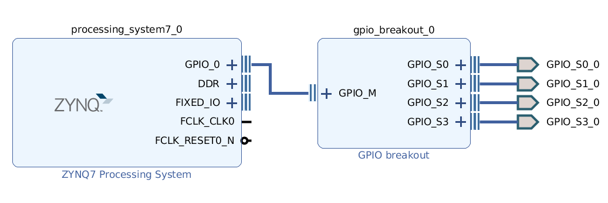

# GPIO breakout

The Zynq's EMIO GPIO pins are bundled together. This module makes it easier to use individual pins of it. You can set the number of pins in the customization GUI.

*Note: This is a packeged IP core. You can add it to the IP Catalog by adding this folder (or any of its parents) in Tools / Settings / IP / Repository*
